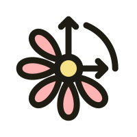
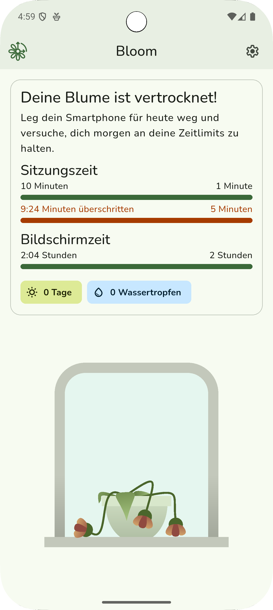
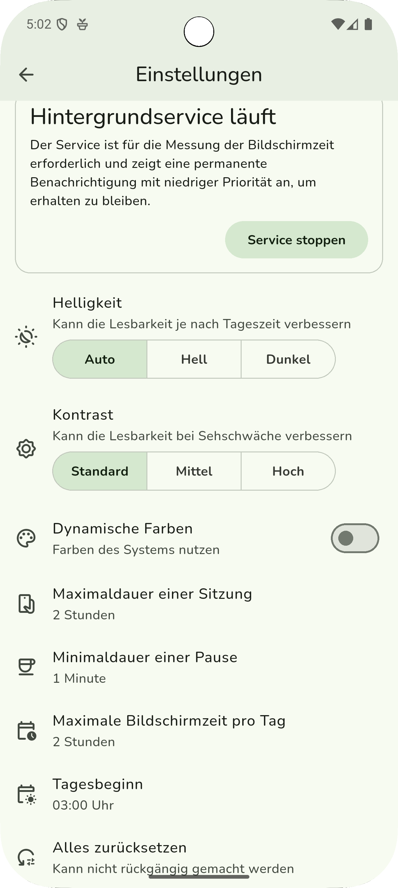

# 📱 Bloom App 

## 🌐 Abstract

**Bloom** is a Flutter-based mobile application designed to help users regulate their screen time in a motivating and positive way. By tracking usage and encouraging regular breaks, it promotes healthier digital habits and supports overall well-being.

## 🧭 Vision

Bloom motivates users to spend more time offline by connecting their digital habits to the health of a digital flower — encouraging balance between screen use and real-life moments.

## 💡 Problem

In everyday life, users in Germany (and beyond) often spend too much time on their smartphones. Excessive usage can negatively affect sleep quality, concentration, and mental health. However, limiting screen time independently can be difficult. Bloom provides gentle support and guidance to build better habits.

## 📖 Detailed Description

Bloom is tailored for people who spend long periods on their phones or tablets. It monitors:

- **Screen time**: total time the display is active
- **Session time**: how long the user actively uses the device in one go

Based on customizable thresholds, the app reminds users to take breaks and enforces limits gently when needed. If the user locks or unlocks the phone, Bloom recalculates remaining session time intelligently.

All settings — such as maximum session length and break duration — are stored using persistent local storage, allowing seamless continuity between sessions.

Break times are automatically subtracted from active sessions to ensure a smooth, personalized experience.

## 👤 Target Persona

**Name:** Emma  
**Age:** 25  
**Occupation:** University Student  
**Habits:** Uses her smartphone extensively for studying, messaging, and social media  
**Pain Point:** Struggles to manage screen time and often feels digitally fatigued  
**How Bloom Helps:** Emma uses Bloom to set healthy usage limits, take regular breaks, and improve her sleep and focus

## 📱 Screens

### ⚙️ Settings Screen

This screen lets users **customize their time limits and visual look**:

- 🔋 **Background Service**  
  Required for accurate screen time tracking. Runs continuously with a notification.

- 🌗 **Brightness & Contrast Settings**  
  Users can switch between **Auto**, **Light**, or **Dark mode**, and choose between **Standard**, **Medium**, or **High contrast** for better readability and accessibility.

- 🎨 **Dynamic Colors**  
  Optionally use system-wide colors for a more personalized look.

- ⏱️ **Custom Time Limits**  
  Users can freely adjust:
  - **Max session duration**
  - **Min break duration**
  - **Daily screen time limit**
  - **Start of the day** (useful for night owls)

- 🔄 **Reset Settings**  
  All settings can be reset with a single tap — irreversible.

### 🌼 Home Screen

The home screen visually reflects your daily phone use:

- 🌱 If you're within your limits, you’ll see a **healthy flower** and motivating stats.
- 🌾 If the **session time ends**, you enter a **grace period** – the flower looks **slightly wilted**, but **can still be saved** by putting your phone away in time.
- 🥀 If the **grace period** is also exceeded, the flower **fully withers**, and a gentle message encourages you to try again tomorrow.

Key data shown:
- **Session time** (since last break)
- **Total screen time today**
- **Daily streak** and **earned drops**, shown with icons

This visual system turns screen time awareness into a small daily habit — **rewarding balance, not punishment**.

## 📸 Screenshots

  
  

## 🏗 **Architecture**

Bloom follows a **modular architecture** inspired by MVC principles, focusing on clear separation of concerns and platform abstraction. Each layer is responsible for a specific part of the app and interacts only through well-defined interfaces.

## 🧱 **Layers**

### 🖥️ **View Layer**  
Responsible for rendering the user interface. Contains widgets and screens that display data, receive user input, and forward actions to the controller. No business logic is included here.

### 🧩 **Controller Layer**  
Handles interaction logic and application flow. It interprets user actions, communicates with services, and updates the UI based on results.

### ⚙️ **Service Layer**  
Contains core app functionality such as time tracking, session handling, and break logic.

