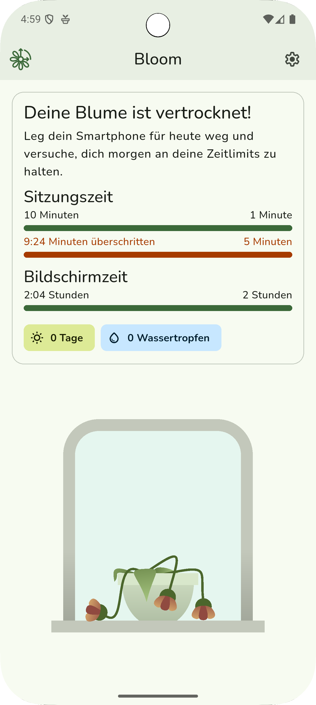
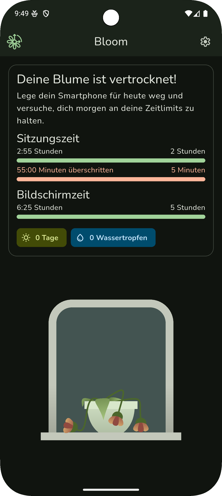
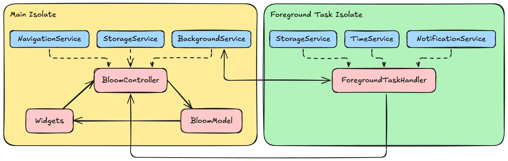

# Bloom: Digital Balance

    

Bloom is a Flutter-based mobile application designed to help users regulate their screen time in a motivating way. By tracking screen time and encouraging regular breaks, it promotes healthier digital habits and supports overall well-being.  
This project is a graded assignment for the Mobile Applications lecture at HTWG Konstanz. Due to various technical limitations, this app has been developed primarily for Android.

## Downloads

## Screenshots

## Details

In everyday life, users often spend too much time on their smartphones. Excessive usage can negatively affect sleep quality, concentration, and mental health. However, limiting screen time independently can be difficult.
Bloom motivates users to spend more time offline by connecting their digital habits to the health of a digital flower, encouraging balance between screen use and real-life moments.

Bloom is tailored for people who spend long periods on their phones or tablets. It monitors:

- **Screen time**: total time the display is active
- **Session time**: how long the user actively uses the device in one go

Based on customizable thresholds, the app reminds users to take breaks and enforces limits gently when needed. If the user locks or unlocks the phone, Bloom recalculates remaining session time and minimum break time intelligently.

## Target Persona

**Name:** Emma  
**Age:** 25  
**Occupation:** University Student  
**Habits:** Uses her smartphone extensively for studying, messaging, and social media  
**Pain Point:** Struggles to manage screen time and often feels digitally fatigued  
**How Bloom Helps:** Emma uses Bloom to set healthy usage limits, take regular breaks, and improve her sleep and focus

## Screens

### Home Screen

The home screen visually reflects your daily phone usage:

- 🌱 If you're within your limits, you’ll see a **healthy flower** and motivating stats.
- 🌾 If the **session time ends**, you enter a **tolerance period** – the flower looks **slightly wilted**, but **can still be saved** by putting your phone away in time.
- 🥀 If the **tolerance period** is also exceeded, the flower **fully withers**, and a gentle message encourages you to try again tomorrow.

Key data shown:
- **Session time** (since last break)
- **Total screen time today**
- **Daily streak** and **earned water drops**

This visual system turns screen time awareness into a small daily habit.

### Settings Screen

This screen lets users customize their time limits and visual look. The background service can also be managed here.

- **Background service state**  
  The service manages screen time tracking in the background. Here it can be started and stopped. A running service is indicated by a silent notification, so the user has to grant permission to show notifications on Android 12+.

- **Color settings**  
  Users can switch between dark and light mode, and choose between different contrast modes for better readability and accessibility. Optionally the system-wide colors can be used for a more personalized look.

- **Time Limits**  
  Users can freely adjust:
  - **Max session duration**
  - **Min break duration**
  - **Daily screen time limit**
  - **Start of the day** (useful for night owls)

- **Reset Settings**  
  All settings can be reset with a single tap. The streak and water drops will not be removed.

## Architecture

Bloom follows a modular architecture inspired by MVC principles, focusing on clear separation of concerns and platform abstraction. Each layer is responsible for a specific part of the app and interacts only through well-defined interfaces.
In [bloom_app.dart](https://github.com/patzly/bloom_flutter/blob/main/lib/bloom_app.dart) each layer is initialized and injected into the others. That's also the only place where the concrete implementations of the layers are created, all other layers only depend on the interfaces of the layers below them.
For state management, the app uses [Bloc](https://pub.dev/packages/flutter_bloc), which allows for efficient state updates with modified [bloom_model](https://github.com/patzly/bloom_flutter/blob/main/lib/model/bloom_model.dart) instances, which are emitted by the [bloom_controller](https://github.com/patzly/bloom_flutter/blob/main/lib/controller/bloom_controller.dart).

The majority of the development time was spent on the services and the complex session/break time calculation logic, which is implemented in the [time_service_impl](https://github.com/patzly/bloom_flutter/blob/main/lib/services/time/time_service_impl.dart).
The main (pain) point is to pause the service when the user locks the phone to save power, and to calculate all times correctly when the user unlocks the phone again. This includes subtracting the elapsed break time fraction from the previously elapsed session time fraction, but additionally influenced by the elapsed tolerance time (exceeding the session time limit) which is added on top in minutes instead of a fraction.

Because all of this has to be done even when the app is closed, a background service is used to continuously calculate the remaining session time and fires notifications when the user exceeds the limits. Android forces an app to even run background tasks in "foreground" with a visible ongoing notification, that's why the used package is called [flutter_foreground_task](https://pub.dev/packages/flutter_foreground_task).
Getting the foreground task up running and communicating with the main app was quite a challenge and is only usable on Android due to system limitations of all other platforms. The foreground task is not a traditional Flutter service, but a separate Dart isolate that runs in the background and communicates with the main app via platform channels.
That's why localization and other Flutter features are not available in the foreground task, even a singleton of [time_service_impl](https://github.com/patzly/bloom_flutter/blob/main/lib/services/time/time_service_impl.dart) can't be created in [bloom_app.dart](https://github.com/patzly/bloom_flutter/blob/main/lib/bloom_app.dart) and passed through.
Instead, the foreground task gets its own instance of [time_service_impl](https://github.com/patzly/bloom_flutter/blob/main/lib/services/time/time_service_impl.dart) [here](https://github.com/patzly/bloom_flutter/blob/4baf656917e4aafcc6573df3d47637072c2aa880/lib/services/background/background_service_android_impl.dart#L15).
The data required by the controller to manipulate the state is send by the foreground task via [callback](https://github.com/patzly/bloom_flutter/blob/4baf656917e4aafcc6573df3d47637072c2aa880/lib/controller/bloom_controller_impl.dart#L187), which then updates the state accordingly.

